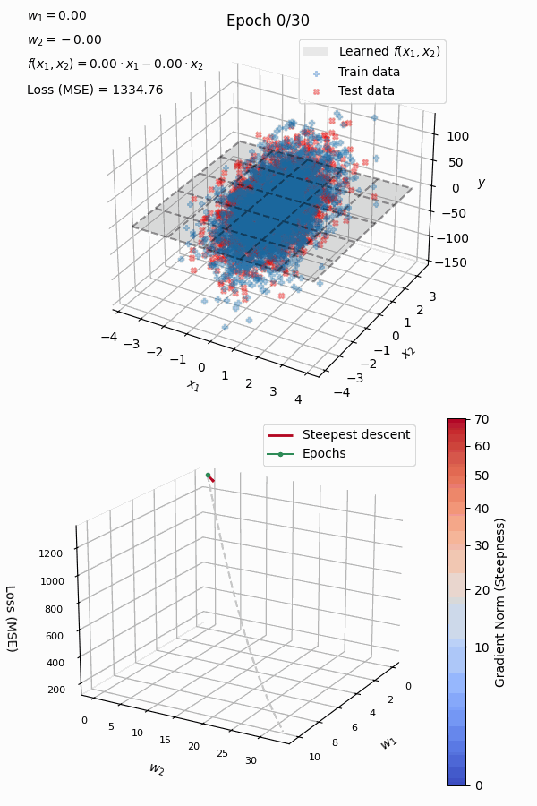
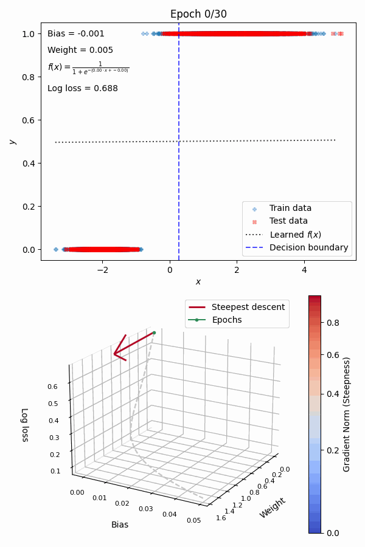
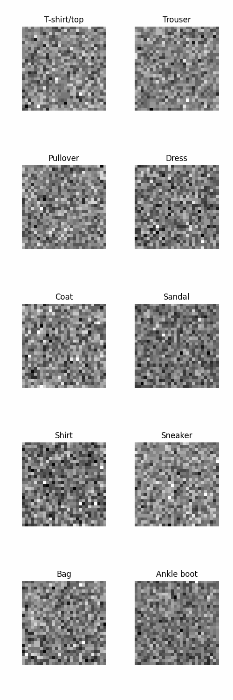

# How does a machine learn?

Beginners may find hard to understand machine learning algorithms, even when they are based on pretty simple ideas. Animations that show how training is actually carried out can be pretty helpful to them. These scripts make it easy to generate such animations.

In the future, I may develop this project further, supporting non-parametric models, unsupersived learning algorithms and so on.