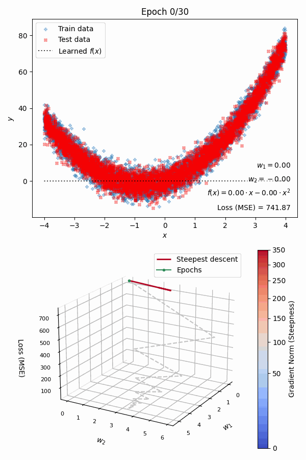

# How does a machine learn?

Beginners may find hard to understand machine learning algorithms, even when they are based on pretty simple ideas.

Animations that show how training is carried out, step by step, can be pretty helpful for them.  

These scripts make it easy to generate such animations.

As of now, only parametric regressors are supported.

In the future, I may develop this project further by adding non-parametric models, classifiers and unsupersived learning algorithms.

